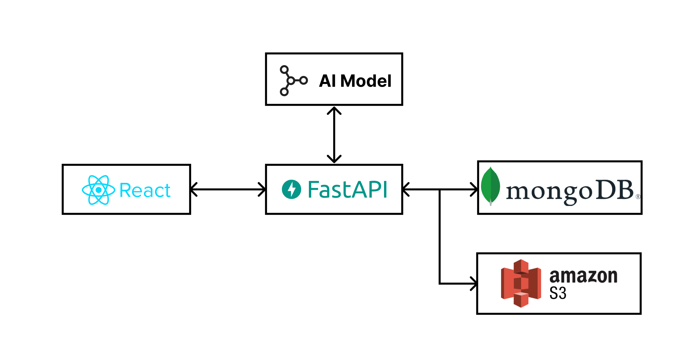
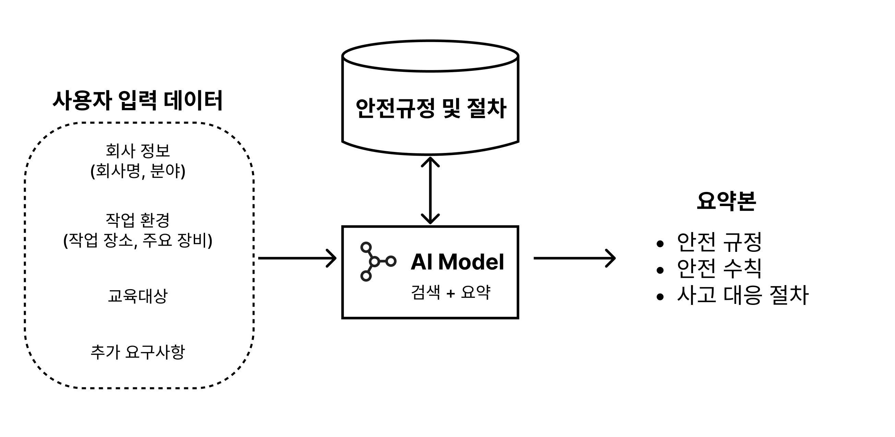

# SAFETY HUB
## 서비스 소개
#### "Building Bridges for Wokers Safety"

SAFETY HUB는 외국인 노동자들의 안전을 위한 교육 자료를 생성형 AI를 기반으로 맞춤형으로 제공합니다. 
이를 통해, 외국인 노동자들의 산업재해 피해를 감소시키고, 현장 안전교육관리자들에겐 교육 자료를 만드는 수고로움을 덜어주는 편의성을 제공합니다.

## 개발계획

### 사용 기술

- FE: JavaScript, React
- BE: Python, FastAPI
- DB: mongoDB, amazon S3
- AI: Python

### 시스템 아키텍쳐
- 서비스 아키텍쳐

- AI 모델 아키텍쳐
